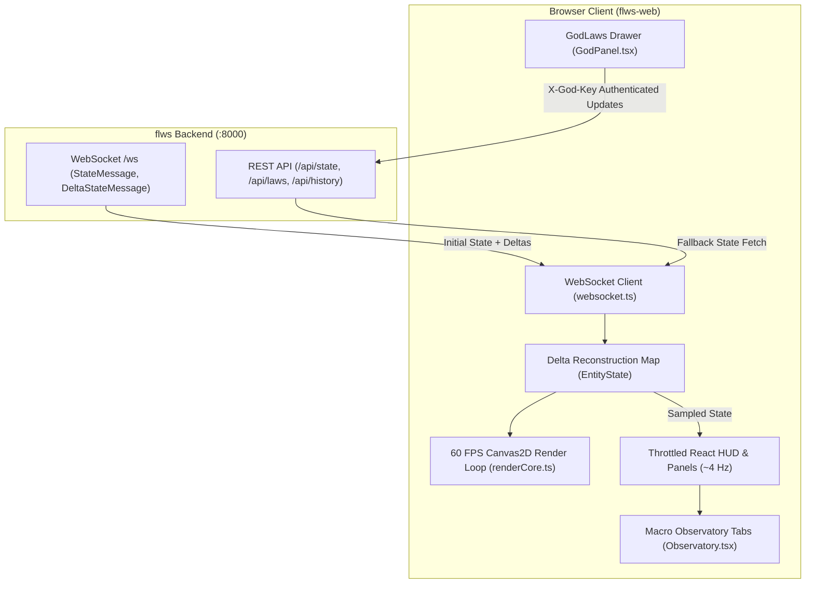

# CONTEXT.md — Flatland Web Client & Observatory (`flws-web`)

## 1. Project Overview & Mission
- **Project Name:** Flatland Web Simulation Client & Macro Observatory (`flws-web`)
- **Production Host:** `https://longphanmn.github.io/flws-web/` (GitHub Pages docs host) / Local `:5173` (Remote fallback: `https://world.minhnhan.in` / `wss://world.minhnhan.in/ws`)
- **Role in Ecosystem:** The primary interactive web viewport, macro telemetry observatory, and static documentation hub for the Flatland simulation ecosystem.
- **Stack:** React 18, TypeScript 5.6, Vite 5.4, HTML5 Canvas2D / WebGL, Tailwind/CSS variables.
- **Dual Operating Modes:**
  1. **Full-Stack Live Client:** Connects via WebSocket (`/ws`) and REST (`/api/*`) to an active `flws` backend instance at `localhost:8000` or a remote node (defaulting to `https://world.minhnhan.in` on GitHub Pages / demo).
  2. **Static Docs Hub:** Serves as the GitHub Pages documentation host for the entire Flatland ecosystem, publishing static builds of the Multilingual Living Wiki (EN, FR, VI), Swagger OpenAPI specification viewer, and Engine Health dashboard.

---

## 2. Domain Vocabulary & Key Concepts

| Term | Category | Definition & Implementation |
| :--- | :--- | :--- |
| **Zero-Allocation Viewport** | Performance | 60 FPS Canvas2D render loop (`renderCore.ts`) reading directly from mutable refs with pre-allocated scratch buffers (`_scratchPts`) to eliminate GC stutter. |
| **Offscreen Hillshade Cache** | Performance | 15,000-cell elevation grid pre-rendered into an `OffscreenCanvas` bitmap, blitted via a single `ctx.drawImage()` per frame. |
| **LOD Culling (`camScale`)** | Performance | Level-of-Detail gating that culls sub-pixel phenotypic features (halos, blade glints, genesis sparks) when zoomed out (`camScale < 3.2`). |
| **Map Lenses (`lensMode`)** | Viewport | 4 visualization modes: `1` Classic (castes/clans), `2` Mutants (asymmetry highlight), `3` Generations (ice-blue to gold gradient), `4` Dynasty (territory spheres). |
| **Delta Reconstruction** | Networking | `websocket.ts` maintains an in-memory `Map<number, EntityState>`, patching `upsert_entities` and deleting `remove_ids` without full-state re-transfers, falling back to `GET /api/state` on premature deltas. |
| **Polar Morphology Radar** | Inspector | Renders the exact polar polygon of a selected creature overlaid against its orthodox Abbott caste ghost template (`Inspector.tsx`). |
| **Macro Observatory** | Telemetry | 5 full-screen telemetry views in `Observatory.tsx`: `MutationLab`, `MacroOverview`, `EcologyTab`, `SociologyTab`, and `CrisisTab`. |
| **The Sphere Control Panel** | God Mode | `GodPanel.tsx` drawer providing real-time sliders over the 6 macro domains (13 law groups) of natural laws, protected by PBKDF2 passkey auth. |

---

## 3. Architecture & Data Flow



### Architectural Seams & Performance Guards
- **Render Loop Decoupling:** Canvas rendering runs at 60 FPS via `requestAnimationFrame` reading from mutable refs. Heavy React DOM elements (sidebars, feeds, demography charts) are decoupled and memoized with `React.memo`, throttled to ~4 Hz (250ms).
- **Network Resilience:** Automatically reconnects dropped WebSockets; mid-stream joins missing a full snapshot automatically issue a fallback `GET /api/state` request.

---

## 4. Key Workflows & Commands

```bash
# 1. Install dependencies
cd /root/workspace/flatland/flws-web
npm install

# 2. Start development server (proxies /ws and /api to http://localhost:8000)
npm run dev
# Open http://localhost:5173

# 3. Production Build
npm run build
# Compiles TypeScript and builds optimized bundle to dist/

# 4. Preview production build
npm run preview
# Serves dist/ on http://localhost:5173

# 5. Build and run via Docker
docker build -t flatland-frontend .
docker run -p 5173:80 flatland-frontend
```

---

## 5. File & Directory Layout

```
flws-web/
├── src/
│   ├── analytics/              # Macro Observatory tabs & telemetry
│   │   ├── Observatory.tsx     # Full-screen macro dashboard
│   │   ├── MacroOverview.tsx   # Demographics, vital health & sparklines
│   │   ├── SociologyTab.tsx    # Clan hegemony, trade caravans, war records
│   │   ├── EcologyTab.tsx      # Flora diversity, soil health, trophic pyramid
│   │   ├── CrisisTab.tsx       # Epidemic spread, starvation & disaster logs
│   │   └── MutationLab.tsx     # Phylogeny trees & morphospace scatter plots
│   ├── render/                 # Viewport rendering engine
│   │   ├── CanvasRenderer.tsx  # Interactive 60 FPS canvas viewport
│   │   ├── renderCore.ts       # Canvas2D drawing engine, LOD gates & scratch pools
│   │   ├── webglRenderer.ts    # WebGL instanced sprite renderer
│   │   ├── raycast.ts          # Raycast sensor projection math
│   │   ├── ClanPanel.tsx       # Live clan settlements & war records
│   │   ├── ChronicleFeed.tsx   # Filterable real-time event log
│   │   └── OverviewPanel.tsx   # Day-trend demographics & mortality
│   ├── inspect/                # Creature inspector & phenotypic radar
│   │   └── Inspector.tsx       # Dossier, vitals, inventory & family tree
│   ├── clan/                   # Clan inspection & diplomatic relations
│   │   └── ClanDetails.tsx     # Clan genealogy, totems, territory & treaties
│   ├── summary/                # World extinction & epoch milestones
│   │   └── WorldEndSummary.tsx # Epoch completion & extinction dossier modal
│   ├── god/                    # Laws of Nature control drawer
│   │   ├── GodPanel.tsx        # Interactive sliders & curated world presets
│   │   └── auth.tsx            # Passkey dialog & authorized godFetch client
│   ├── history/                # World history, war arcs & AI Story export
│   ├── components/             # Reusable UI components & avatars
│   ├── wiki/                   # In-app interactive wiki modal
│   ├── i18n/                   # Multi-language localization (EN, FR, VI)
│   ├── config.ts               # Runtime API/WS endpoint resolution & remote fallback
│   ├── websocket.ts            # Auto-reconnecting WebSocket client with delta sync
│   ├── types.ts                # TypeScript schemas mirroring backend protocol.py
│   ├── totems.ts               # 8 Sacred Avatars of the Sphere metadata
│   ├── App.tsx                 # Main layout, HUD, WS sync & drawer navigation
│   └── main.tsx                # React root bootstrap
├── public/                     # Static documentation & PWA assets
│   ├── wiki/                   # Static Living Wiki (EN, FR, VI)
│   ├── docs/                   # Static Swagger API documentation viewer & god-laws.md
│   ├── health/                 # Static engine health status dashboard
│   ├── openapi.json            # Static OpenAPI specification mirror
│   ├── 404.html                # GitHub Pages SPA router
│   └── manifest.webmanifest    # PWA configuration
├── Dockerfile                  # Multi-stage production container (Node -> Nginx)
├── nginx.conf                  # Production reverse proxy configuration
├── vite.config.ts              # Vite configuration with proxy & health page
├── tsconfig.json               # TypeScript configuration
└── package.json                # Dependencies & build scripts
```

---

## 6. Code Conventions & Styling Guidelines
- **Type Parity:** Any modification to backend wire structures in `flws/backend/app/protocol.py` must be immediately mirrored in `src/types.ts`.
- **Zero Allocations in Render Loops:** Never allocate new arrays, objects, or strings inside the `requestAnimationFrame` loop in `renderCore.ts`. Use pre-allocated buffers.
- **Throttling React Updates:** High-frequency simulation state updates must not trigger re-renders of the full React component tree; isolate high-frequency data to Canvas and refs.
